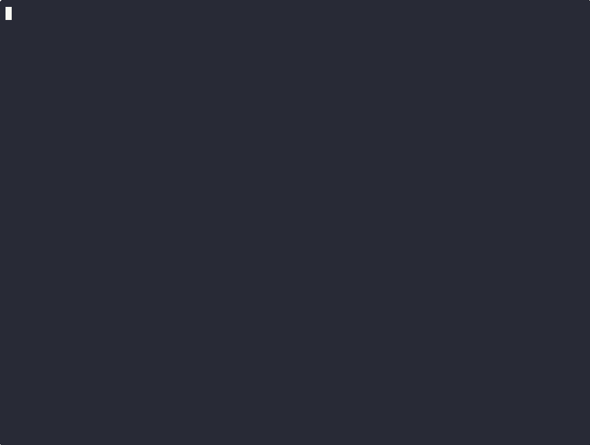

# triage-mesh


**A multi-agent vulnerability triage system that treats protocols, privilege, and untrusted data as first-class architectural concerns.**

An orchestrator delegates to specialist agents over **A2A**; each agent reaches its tools through **MCP** servers built on the 2026-07-28 stateless spec. Every boundary is schema-validated, every tool call passes a deterministic policy engine, and the whole topology is enforced twice — once in the harness, once in Kubernetes NetworkPolicies. The working assumption throughout: **the LLM is an untrusted component**; every guarantee lives in the scaffolding, and every guarantee is exercised by a test.

- Deny-by-default **policy engine** enforced in the harness before any tool call leaves an agent
- **Trust-labeled** untrusted text; findings derive only from typed fields injections can't reach
- Audience-scoped **service JWTs** on every internal call; human approval on the only irreversible action
- **Pinned tool manifests** — each MCP server's tool names, descriptions, and schemas are hashed into the policy file; the harness re-verifies before an agent's first call and refuses a server whose manifest drifted (tool-poisoning / rug-pull defense)
- A **red-team suite of 13 attack scenarios** that must fail closed in CI ([tests/redteam](tests/redteam/test_attacks.py), each mapped to a threat in [docs/threat-model.md](docs/threat-model.md))
- The flagship's own trajectory is **regression-gated by [multiclaw-harness](https://github.com/AIML-Solutions/multiclaw-harness)** in CI: expected tool sequence, forbidden actions, budgets, outcome rubric
- **NetworkPolicies generated** from the same policy file the harness reads, enforced by Calico, proven by a conformance suite
- **One distributed trace per assessment** across all seven services (OpenTelemetry → Jaeger)

> Design source of truth: [docs/architecture.md](docs/architecture.md) · [docs/why-two-protocols.md](docs/why-two-protocols.md) · [docs/threat-model.md](docs/threat-model.md)

## Quickstart

```bash
./demo/run-demo.sh
```



Builds the seven containers, assesses the deliberately vulnerable seed repo, prints the findings (46 live advisories from OSV at last run), and asks you — the human gate — whether to publish. Zero token spend by default (`MODEL_PROVIDER=mock`); set `MODEL_PROVIDER=anthropic` and `ANTHROPIC_API_KEY` for real model narration. Tests: `make test`.

The compose networks encode the zero-trust topology: each agent can reach its own MCP server and nothing else, and only `vuln-intel` has internet egress. Try it: `docker compose -f deploy/compose.yaml exec scanner python -c "import socket; socket.create_connection(('mcp-vuln-intel', 7102), timeout=3)"` — it fails by design.

### Kubernetes

```bash
make cluster-demo   # kind + Calico, build & load image, helm install, conformance suite
```

The Helm chart lives in `deploy/chart/`. Its NetworkPolicies are **generated from the same `deploy/policies.yaml` topology the harness policy engine reads** (`make netpol`; CI fails on drift), and the cluster runs Calico so they are enforced, not decorative. `scripts/cluster-conformance.sh` proves it: eleven reachability checks (allowed paths open, forbidden paths blocked) plus the full pipeline through the cluster. Non-root numeric UIDs, resource limits, liveness/readiness probes, secrets via K8s Secrets.

## What it does

Given a repository, the crew produces a human-gated vulnerability assessment:


1. **Scanner** reads dependency manifests and lockfiles through a read-only MCP server.
2. **Intel** queries the live OSV.dev API for advisories — real third-party APIs, with retry/backoff and rate-limit handling.
3. **Assessor** judges exploitability in context and drafts a remediation report that a human approves. Nothing writes without the gate.

## Why it's built this way

- **Two protocols, one boundary rule** — A2A for agent↔agent, MCP for agent↔tool. The decision and its trade-offs are written down in [docs/why-two-protocols.md](docs/why-two-protocols.md).
- **Security you can watch fail closed** — CVE descriptions and repo contents are *untrusted input to the system, not instructions*. Trust labels, Pydantic validation at every boundary, and a declarative policy engine gate each tool call. A red-team suite (injected advisory text, smuggled tool-result fields, over-scoped calls, stolen tokens) runs in CI. See [docs/threat-model.md](docs/threat-model.md).
- **Zero-trust twice** — the harness enforces least privilege in code; Helm-managed NetworkPolicies enforce the same topology in the cluster, so a compromised agent container still can't reach a tool it was never meant to call.

## Observability

With the compose stack up, every assessment renders as **one distributed trace across all seven services** — the `assessment` root span, A2A delegation, each policied `tool.call` (with its policy verdict as a span attribute), and the OSV calls beneath. Open Jaeger at [http://localhost:16686](http://localhost:16686). Tracing is opt-in via `OTEL_EXPORTER_OTLP_ENDPOINT` (compose sets it; tests and bare runs pay nothing), and structured JSON logs carry the same correlation id across services either way.

## Development

```bash
make sync     # install (uv)
make test     # 53 tests incl. the red-team suite
uv run ruff check src tests scripts && uv run ruff format --check src tests scripts
make netpol   # regenerate NetworkPolicies after editing deploy/policies.yaml topology
```

Layout: `src/triage_mesh/` — `schemas.py` (typed boundary objects), `harness/` (policy, trust, auth, telemetry, A2A/MCP glue), `agents/` (three thin agents), `mcp_servers/`, `orchestrator/`. `deploy/policies.yaml` is the single source of truth for privileges *and* topology; CI fails if generated policies drift from it.

## Roadmap

| Phase | Deliverable | Status |
|---|---|---|
| 0 | Architecture, protocol-boundary, and threat-model docs | ✅ |
| 1 | Happy path end-to-end: orchestrator + 3 agents + 3 MCP servers, one-command demo | ✅ |
| 2 | Policy engine, trust labels, service JWTs, red-team suite in CI | ✅ |
| 3 | Helm chart, generated NetworkPolicies, kind+Calico conformance suite | ✅ |
| 4 | OpenTelemetry tracing, lint/format CI gate, license & metadata, demo assets | ✅ |

## Stack

Python 3.12+ · official MCP SDK 2.x (2026-07-28 spec) · A2A SDK · FastAPI · Pydantic v2 · OpenTelemetry · Anthropic API (provider-configurable, zero-spend mock default) · Docker Compose · Helm · kind + Calico

## License

[MIT](LICENSE)
