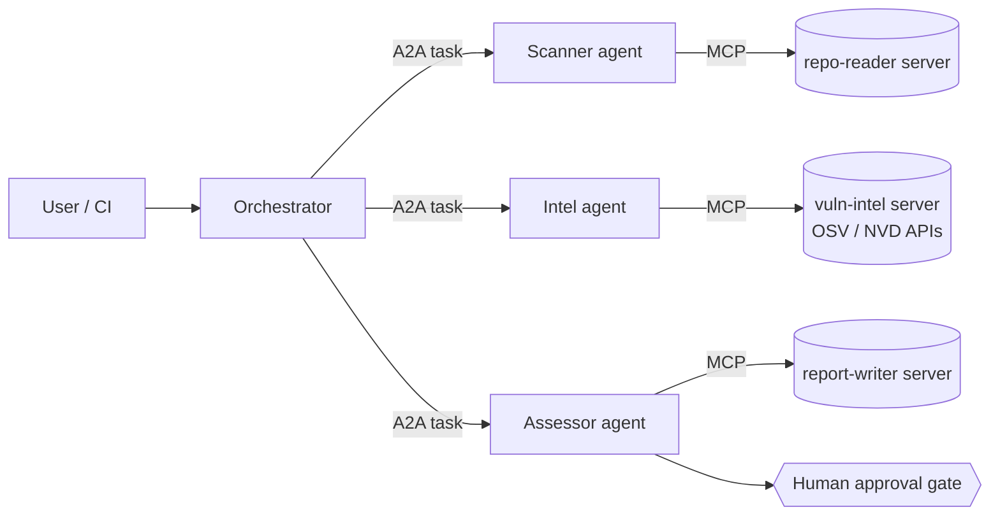

# triage-mesh


**A multi-agent vulnerability triage system that treats protocols, privilege, and untrusted data as first-class architectural concerns.**

An orchestrator delegates to specialist agents over **A2A**; each agent reaches its tools through **MCP** servers built on the 2026-07-28 stateless spec. Every boundary is schema-validated, every tool call passes a deterministic policy engine, and the whole topology is enforced twice — once in the harness, once in Kubernetes NetworkPolicies.

> Status: phase 2 complete — the security layer is live and adversarially tested: a deny-by-default policy engine enforced in the harness, trust-labeled untrusted text, audience-scoped service JWTs on every internal call, and a **red-team suite of 12 attack scenarios that must fail closed in CI** ([tests/redteam](tests/redteam/test_attacks.py), each mapped to a threat in [docs/threat-model.md](docs/threat-model.md)). Design source of truth: [docs/architecture.md](docs/architecture.md).

## Quickstart

```bash
./demo/run-demo.sh
```

Builds the seven containers, assesses the deliberately vulnerable seed repo, prints the findings (46 live advisories from OSV at last run), and asks you — the human gate — whether to publish. Zero token spend by default (`MODEL_PROVIDER=mock`); set `MODEL_PROVIDER=anthropic` and `ANTHROPIC_API_KEY` for real model narration. Tests: `make test`.

The compose networks encode the zero-trust topology: each agent can reach its own MCP server and nothing else, and only `vuln-intel` has internet egress. Try it: `docker compose -f deploy/compose.yaml exec scanner python -c "import socket; socket.create_connection(('mcp-vuln-intel', 7102), timeout=3)"` — it fails by design.

## What it does

Given a repository, the crew produces a human-gated vulnerability assessment:



1. **Scanner** reads dependency manifests and lockfiles through a read-only MCP server.
2. **Intel** queries live OSV/NVD APIs for advisories — real third-party APIs, with retry/backoff and rate-limit handling.
3. **Assessor** judges exploitability in context and drafts a remediation report that a human approves. Nothing writes without the gate.

## Why it's built this way

- **Two protocols, one boundary rule** — A2A for agent↔agent, MCP for agent↔tool. The decision and its trade-offs are written down in [docs/why-two-protocols.md](docs/why-two-protocols.md).
- **Security you can watch fail closed** — CVE descriptions and repo contents are *untrusted input to the system, not instructions*. Trust labels, Pydantic validation at every boundary, and a declarative policy engine gate each tool call. A red-team suite (poisoned tool descriptions, injected advisory text, over-scoped calls) runs in CI. See [docs/threat-model.md](docs/threat-model.md).
- **Zero-trust twice** — the harness enforces least privilege in code; Helm-managed NetworkPolicies enforce the same topology in the cluster, so a compromised agent container still can't reach a tool it was never meant to call.

## Roadmap

| Phase | Deliverable | Status |
|---|---|---|
| 0 | Architecture, protocol-boundary, and threat-model docs | ✅ |
| 1 | Happy path end-to-end: orchestrator + 3 agents + 3 MCP servers, one-command demo | ✅ |
| 2 | Policy engine, trust labels, service JWTs, red-team suite in CI | ✅ |
| 3 | Helm chart, NetworkPolicies, kind-reproducible cluster deploy | next |
| 4 | Observability, demo recording, write-up | |

## Stack

Python · official MCP SDK (2026-07-28 spec) · A2A SDK · FastAPI · Pydantic · Anthropic API (provider-configurable) · Docker · Helm/Kubernetes
