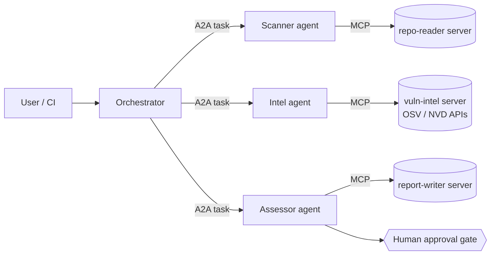

# triage-mesh

**A multi-agent vulnerability triage system that treats protocols, privilege, and untrusted data as first-class architectural concerns.**

An orchestrator delegates to specialist agents over **A2A**; each agent reaches its tools through **MCP** servers built on the 2026-07-28 stateless spec. Every boundary is schema-validated, every tool call passes a deterministic policy engine, and the whole topology is enforced twice — once in the harness, once in Kubernetes NetworkPolicies.

> Status: design phase. Architecture documents are the current deliverable; see [docs/architecture.md](docs/architecture.md).

## What it does

Given a repository, the crew produces a human-gated vulnerability assessment:

1. **Scanner** reads dependency manifests and lockfiles through a read-only MCP server.
2. **Intel** queries live OSV/NVD APIs for advisories — real third-party APIs, with retry/backoff and rate-limit handling.
3. **Assessor** judges exploitability in context and drafts a remediation report that a human approves. Nothing writes without the gate.

## Why it's built this way

- **Two protocols, one boundary rule** — A2A for agent↔agent, MCP for agent↔tool. The decision and its trade-offs are written down in [docs/why-two-protocols.md](docs/why-two-protocols.md).
- **Security you can watch fail closed** — CVE descriptions and repo contents are *untrusted input to the system, not instructions*. Trust labels, Pydantic validation at every boundary, and a declarative policy engine gate each tool call. A red-team suite (poisoned tool descriptions, injected advisory text, over-scoped calls) runs in CI. See [docs/threat-model.md](docs/threat-model.md).
- **Zero-trust twice** — the harness enforces least privilege in code; Helm-managed NetworkPolicies enforce the same topology in the cluster, so a compromised agent container still can't reach a tool it was never meant to call.

## Roadmap

| Phase | Deliverable |
|---|---|
| 0 (now) | Architecture, protocol-boundary, and threat-model docs |
| 1 | Happy path end-to-end: orchestrator + 3 agents + 3 MCP servers, `docker compose up` demo |
| 2 | Policy engine, trust labels, red-team suite in CI |
| 3 | Helm chart, NetworkPolicies, kind-reproducible cluster deploy |
| 4 | Observability, demo recording, write-up |

## Stack

Python · official MCP SDK (2026-07-28 spec) · A2A SDK · FastAPI · Pydantic · Anthropic API (provider-configurable) · Docker · Helm/Kubernetes
